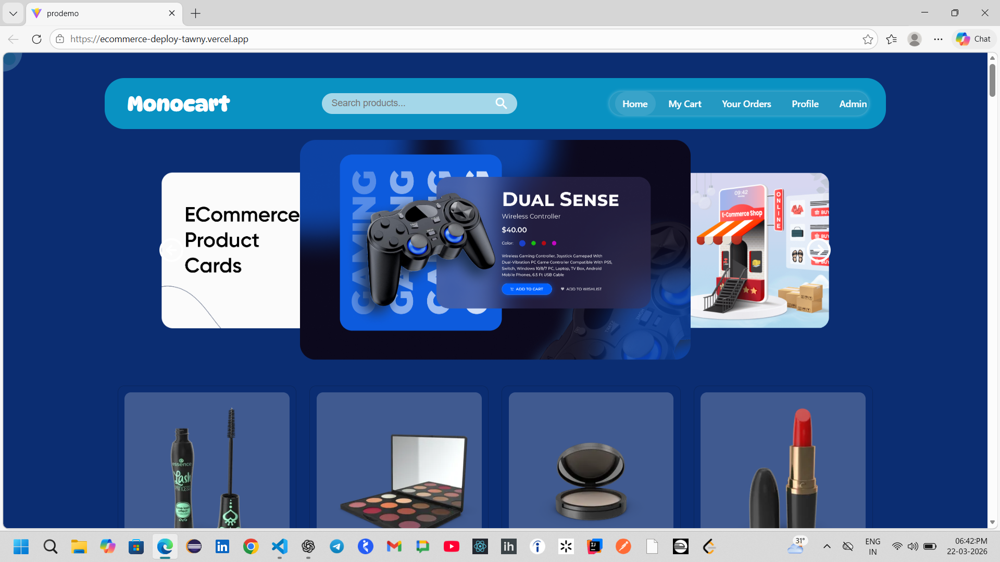
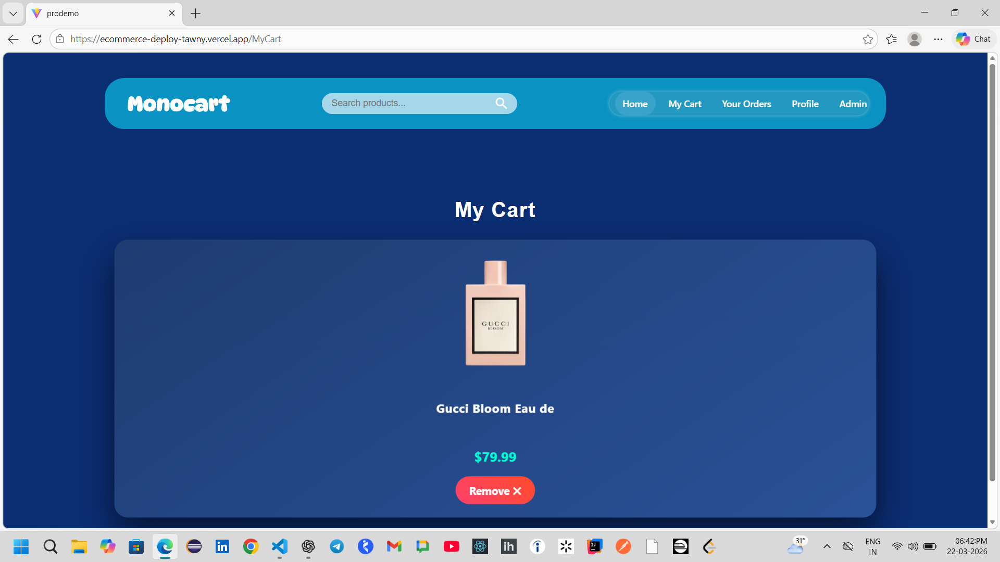
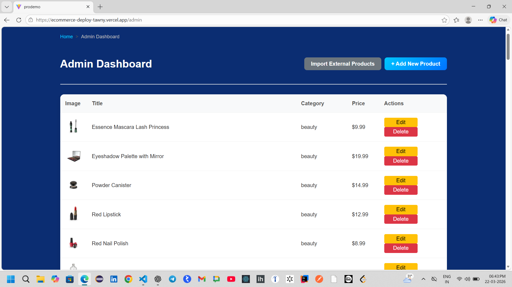

# 🛒 E-commerce Web Application

## 🔗 Live Demo
https://ecommerce-deploy-tawny.vercel.app/

---

## 📌 Project Overview
This is a full-stack e-commerce web application where users can browse products, add items to cart, and place orders. It also includes a secure admin dashboard for managing products.

---

## 🚀 Features

### 👤 User Features
- User Registration & Login  
- Browse Products  
- View Product Details  
- Add to Cart  
- Place Orders  
- View Order History  

### ⚙️ Admin Features
- Secure Admin Dashboard (role-based access)  
- Add New Products  
- Edit Existing Products  
- Delete Products  
- Import External Products  

---

## 🔐 Demo Credentials

### 👨‍💼 Admin Access
- Username: **admin**  
- Password: **12345**  

> Use these credentials to access the admin dashboard at `/admin`

---

## 🛠️ Tech Stack

**Frontend:**
- React (Vite)
- HTML, CSS, JavaScript

**Backend:**
- Spring Boot
- REST APIs

**Database:**
- MySQL

**Deployment:**
- Vercel (Frontend)
- Railway (Backend)

---

## 📸 Screenshots

### 🏠 Home Page


### 🛒 Cart Page


### ⚙️ Admin Dashboard

## 🔐 Authentication & Authorization
- Role-based access (Admin/User)  
- Protected admin routes  
- Local storage-based session handling  

---

## 📦 Run Locally

### Frontend
```bash
npm install
npm run dev